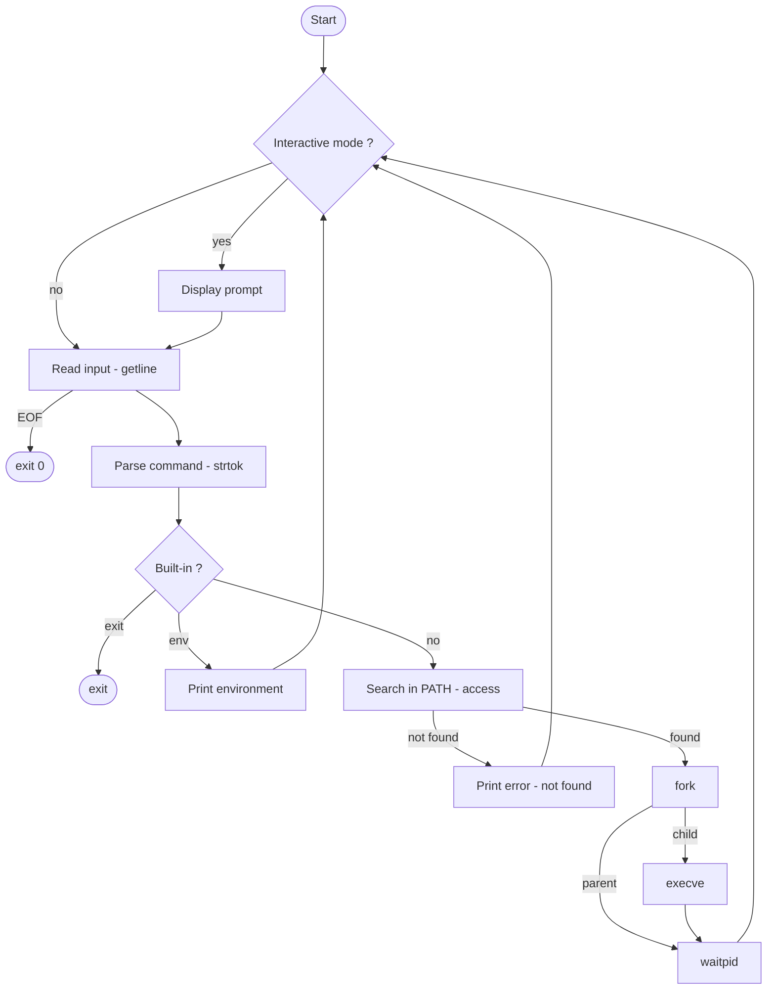

# Simple Shell — hsh

A simple UNIX command line interpreter written in C, reproducing the basic behavior of `/bin/sh`.

---

## Description

`hsh` is a simple shell written in C as part of the Holberton School curriculum.
It reads commands from standard input (interactive or non-interactive), searches
for them in the `PATH`, and executes them using `fork()` and `execve()`.

---

## Features

- Interactive and non-interactive mode
- Command execution with full path (`/bin/ls`) or via `PATH` resolution (`ls`)
- Error handling mimicking `/bin/sh`
- Built-ins: `exit`, `env`
- Handles `EOF` (Ctrl+D)
- Betty style compliant
- No memory leaks

---

## Requirements

- Ubuntu 20.04 LTS
- GCC with flags: `-Wall -Werror -Wextra -pedantic -std=gnu89`

---

## Compilation

```bash
gcc -Wall -Werror -Wextra -pedantic -std=gnu89 *.c -o hsh
```

---

## Usage

### Interactive mode

```bash
$ ./hsh
($) /bin/ls
hsh main.c shell.h find_path.c split_line.c builtins.c execute.c
($) ls
hsh main.c shell.h find_path.c split_line.c builtins.c execute.c
($) exit
$
```

### Non-interactive mode

```bash
$ echo "/bin/ls" | ./hsh
hsh main.c shell.h find_path.c split_line.c builtins.c execute.c

$ cat commands.txt | ./hsh
hsh main.c shell.h find_path.c split_line.c builtins.c execute.c
```

---

## Error handling

The shell prints errors using the program name as it was called:

```bash
$ echo "qwerty" | ./hsh
./hsh: 1: qwerty: not found

$ echo "qwerty" | ./././hsh
./././hsh: 1: qwerty: not found
```

---

## How it works

The shell runs a continuous loop:

1. Display the prompt `($)` if in interactive mode (`isatty`)
2. Read the input line with `getline()`
3. Parse the line into an argument array with `strtok()`
4. Check if the command is a built-in (`exit`, `env`)
5. Search for the command in `PATH` using `access()`
6. Create a child process with `fork()`
7. Execute the command in the child with `execve()`
8. Wait for the child to finish with `waitpid()`
9. Repeat

---

## Flowchart



---

## File structure

| File | Description |
|------|-------------|
| `main.c` | Entry point — main loop, input reading, command dispatching |
| `execute.c` | Fork, execve and waitpid — child process execution |
| `builtins.c` | Built-in commands: `exit` and `env` |
| `find_path.c` | PATH resolution — searches command in PATH directories |
| `split_line.c` | Tokenizer — splits input line into argv array |
| `shell.h` | Header file — prototypes and includes |
| `man_1_simple_shell` | Manual page |
| `AUTHORS` | List of contributors |

---

## Testing

### Betty style check

```bash
betty *.c *.h
```

### Memory leaks check

```bash
valgrind --leak-check=full ./hsh
echo "ls" | valgrind --leak-check=full ./hsh
```

### Manual tests

```bash
echo "/bin/ls" | ./hsh
echo "qwerty" | ./hsh
echo "" | ./hsh
echo "/bin/ls -l" | ./hsh
```

---

## Authors

Panaki Gillot <gillotpanaki@gmail.com>

---

## License

This project is part of the Holberton School curriculum.