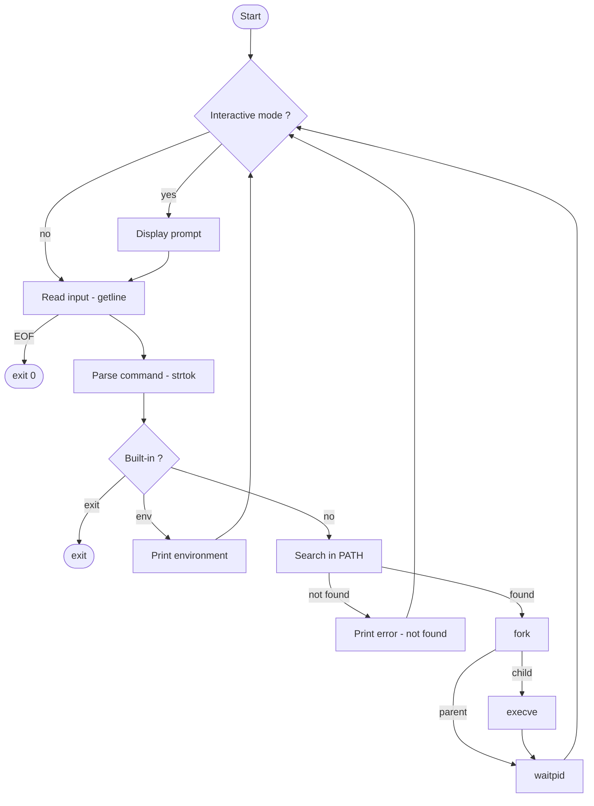

# Simple Shell — hsh

A simple UNIX command line interpreter written in C, reproducing the basic behavior of `/bin/sh`.

## Description

`hsh` is a simple shell written in C as part of the Holberton School curriculum. It reads commands from standard input (interactive or non-interactive), searches for them in the `PATH`, and executes them using `fork()` and `execve()`.

## Features

- Interactive and non-interactive mode
- Command execution with full path (`/bin/ls`) or via `PATH` resolution (`ls`)
- Error handling mimicking `/bin/sh`
- Built-ins: `exit`, `env`
- Handles `EOF` (Ctrl+D)
- Betty style compliant
- No memory leaks

## Requirements

- Ubuntu 20.04 LTS
- GCC with flags: `-Wall -Werror -Wextra -pedantic -std=gnu89`

## Compilation

```bash
gcc -Wall -Werror -Wextra -pedantic -std=gnu89 *.c -o hsh
```

## Usage

### Interactive mode

```bash
$ ./hsh
($) /bin/ls
hsh main.c shell.h find_path.c split_line.c builtins.c execute.c
($) ls
hsh main.c shell.h find_path.c split_line.c builtins.c execute.c
($) exit
$
```

### Non-interactive mode

```bash
$ echo "/bin/ls" | ./hsh
hsh main.c shell.h find_path.c split_line.c builtins.c execute.c

$ cat commands.txt | ./hsh
hsh main.c shell.h find_path.c split_line.c builtins.c execute.c
```

## Error handling

```bash
$ echo "qwerty" | ./hsh
./hsh: 1: qwerty: not found

$ echo "qwerty" | ./././hsh
./././hsh: 1: qwerty: not found
```

## Flowchart



## File structure

| File | Description |
|------|-------------|
| `main.c` | Entry point — main loop, input reading, command dispatching |
| `execute.c` | Fork, execve and waitpid — child process execution |
| `builtins.c` | Built-in commands: `exit` and `env` |
| `find_path.c` | PATH resolution — searches command in PATH directories |
| `split_line.c` | Tokenizer — splits input line into argv array |
| `shell.h` | Header file — prototypes and includes |
| `man_1_simple_shell` | Manual page |
| `AUTHORS` | List of contributors |

## Authors

See [AUTHORS](./AUTHORS)

## License

This project is part of the Holberton School curriculum.